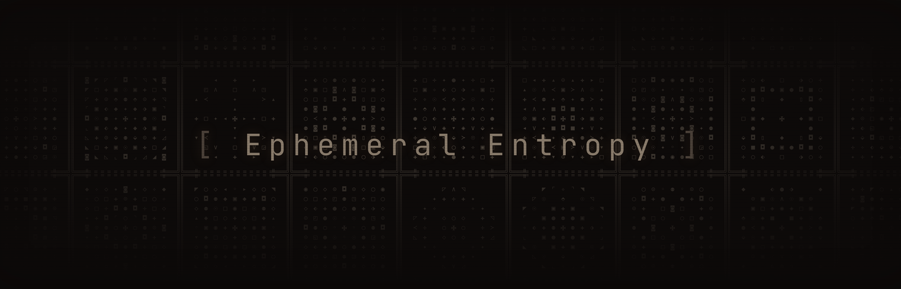
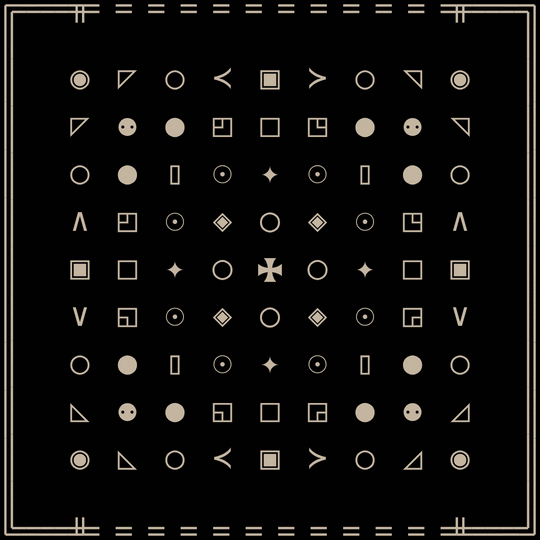
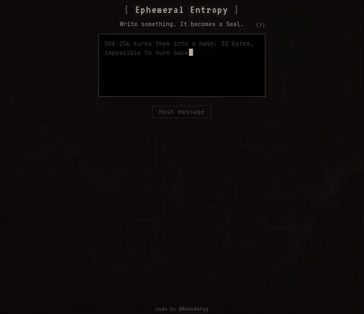
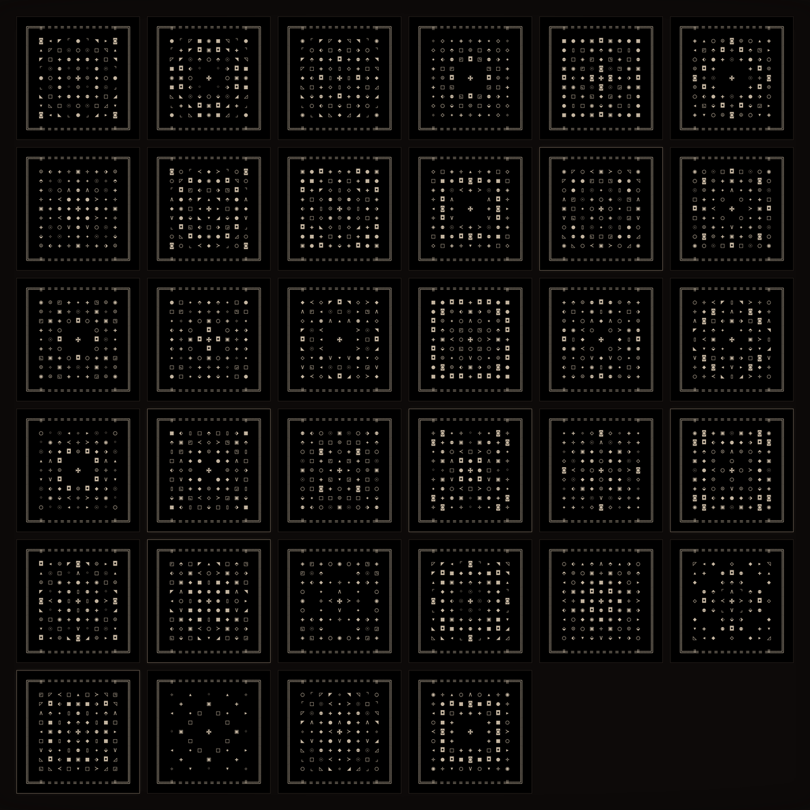
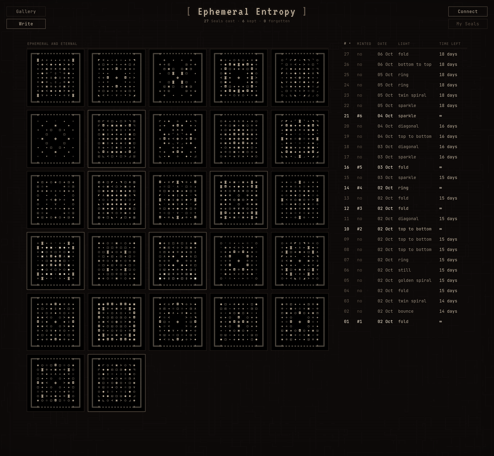

<p align="center"></p>

# Ephemeral Entropy

Write a message and it is folded into a Seal, cast into Ethereum blob space for 18 days, then forgotten by the network. The words stay on your device. Keep the Seal as an NFT: 1,000 supply, 0.00777 ETH, rendered fully on chain, CC0.

**Live:** [remi.gg/ee](https://remi.gg/ee) · **Contract:** [`0x9f07…6e15`](https://etherscan.io/address/0x9f0749bb1d015cdc982a53784d1b692ce5736e15) · **Collection:** [OpenSea](https://opensea.io/collection/ephemeral-entropy)

<p align="center"></p>

## The system

```
  YOUR BROWSER                         RELAYER                          ETHEREUM L1
  ────────────                         ───────                          ───────────

  "hello world"           SALT: 32 random bytes, fresh on every press
       │                  ─────────────────────────────────────────────
       │                  your OS keeps a pool of noise: keystroke
       │                  timing, cursor movement, hardware jitter.
       │                  crypto.getRandomValues draws 32 bytes from it.
       │                  nobody can predict them, not even this page.
       │                           │
       └──────────┬────────────────┘
                  ▼
       SHA-256( salt ‖ message )
                  │
                  ▼
               ┌──────┐   words cleared,
               │ ASH  │   salt thrown away
               └──┬───┘   (32 bytes, one-way)
                  │
                  │       "hello world" + salt A  →  ash 3fa1…  →  Seal A
                  │       "hello world" + salt B  →  ash 3afe…  →  Seal B
                  │       same words, a different Seal every time,
                  │       and no way to check a guess against one
           ┌──────┘
           │
           ├──► fold ──► ┌ ─ ─ ─ ─ ─ ┐
           │             │  9 × 9    │   same ash, same Seal, always
           │             │  Seal  ✠  │
           │             └ ─ ─ ─ ─ ─ ┘
           │
           │  POST /cast {ash}
           └──────────────────────────► fold again,
                                       refuse a Seal already cast,
                                       Seal × N fills one blob ──────────► ┌──────────────────┐
                                       (relayer pays the gas)              │ BLOB  128 KB     │
                                                                           │ the Seal, again  │
                                       index.json  ◄─── block, expiry      │ and again …      │
                                       (lists sha256(ash),                 │ remi.gg/ee  Mt …  │
                                        never the ash)                     └────────┬─────────┘
                                                                                    │ 4,096 epochs
                                                                                    ▼ ≈ 18 days
                                                                              pruned by the network

  ── KEEP IT (optional) ──────────────────────────────────────────────────────────────────────

  connect wallet ── POST /sign {ash, to} ──► EIP-712 signature over
                                             Cast(payer, to, ash, blobHash, expiry)
           │                                          │
           ▼                                          ▼
  mint(to, ash, blobHash, expiry, sig)  ─────────────────────────────────► EphemeralEntropy (ERC-721)
  0.00777 ETH, exact                                                       stores ash + blob hash
                                                                                    │
                                                                           SealRenderer folds the ash
                                                                           and draws the SVG on chain
```

<p align="center"></p>

## 1. Write

You type in a box. The text lives in that box and nowhere else.

## 2. Salt and hash

When you press the button, the browser draws **32 random bytes** with `crypto.getRandomValues`. They come from your operating system's entropy pool, stirred by the exact timing of keystrokes, cursor movement and the noise of your hardware. Even the page cannot predict them.

The salt goes in front of your words and the whole thing is hashed once:

```
ash = SHA-256( salt[32] ‖ utf8(message) )
```

Then the box is cleared and the salt is thrown away. The salt is why the same words never make the same Seal twice, and why nobody can test a guess against a Seal. SHA-256 is one-way: the 32 bytes of ash are all that is left.

The ash goes into the URL fragment (`/seal/#<ash>`). Browsers keep the fragment out of requests to the server, so the link is your Seal and your souvenir.

## 3. Fold

[`fold2.js`](fold2.js) turns 32 bytes into a 9×9 grid of glyphs. Integer math only, so the browser, the Python twin and the Solidity contract agree cell for cell.

- **Eight-fold symmetry.** 15 cells are chosen in one triangle of the top-left quarter; the rest are mirrors. Directional glyphs swap with their twin on the diagonal (▴↔◂, ▾↔▸).
- **✠ at the centre**, always. Everything else comes from the ash.
- **Character before glyphs.** The first bytes pick what kind of Seal it is: a weight profile (core, edge, band, flat), sparse or full, a motif group (circles, squares, crosses, corners, pointers), anchored tips, one double allowed or none, and the style of the eight cells around the heart.
- **Palette:** 49 glyphs plus ✠, spread light to heavy, traced from DejaVu Sans Mono.
- **Blank cells are U+2800**, the Braille blank: 3 bytes like every glyph, so each row keeps its exact byte length in the blob.

<p align="center"></p>

## 4. Cast

The page sends the ash to the relayer (`POST /cast`). The relayer folds it again, checks that this exact Seal text was never cast before, and sends **one blob transaction for that one Seal**. The writer pays nothing.

The blob is 4,096 field elements of 32 bytes. Every field element has to stay below the BLS12-381 modulus, so the Seal is laid out to make the first byte of each one plain ASCII: a 9-space margin, each line padded to a 32-byte boundary, dashed borders. Then the Seal is **repeated until the blob is full**. Scroll to the bottom of the blob in Etherscan's UTF-8 view and the last line is `remi.gg/ee` and a New Testament reference, picked by the Seal itself.

Ethereum keeps blobs for **4,096 epochs, about 18 days**. After that the consensus nodes prune it. Archives like Blobscan may keep a copy; the words were never in it.

The relayer's `index.json` lists each Seal by `sha256(ash)`. A page can find its own Seal and nobody can lift the ash off the list.

## 5. Keep

The Seal can be minted while its blob is alive.

1. The wallet asks the relayer for a signature: `POST /sign {ash, to}`.
2. The relayer signs an EIP-712 `Cast(payer, to, ash, blobHash, expiry)`. The payer is part of the signature, so a pending mint cannot be replayed from another wallet. Naming a friend's wallet as `to` makes it a gift.
3. `mint(to, ash, blobHash, expiry, sig)` with exactly 0.00777 ETH. `mintMany` keeps up to 10 Seals in one transaction.

One mint per ash and one per blob hash. The token stores two things: the ash and the blob hash. Everything else is computed on read.

## On chain

| Contract | Address | Job |
| --- | --- | --- |
| EphemeralEntropy | [`0x9f0749bb1d015cdc982a53784d1b692ce5736e15`](https://etherscan.io/address/0x9f0749bb1d015cdc982a53784d1b692ce5736e15) | ERC-721, 1,000 supply, ERC-2981 3.33% |
| SealRenderer | [`0x328da9d3accff531de866c285cb3c9740058bcd6`](https://etherscan.io/address/0x328da9d3accff531de866c285cb3c9740058bcd6) | folds the ash, draws the SVG, builds `tokenURI` |
| SealShapes | [`0x54658a18e8b085bf78129cebe5a596f3f596b14a`](https://etherscan.io/address/0x54658a18e8b085bf78129cebe5a596f3f596b14a) | the traced glyph paths |

The renderer runs the same fold as `fold2.js` in Solidity, tested against 75 fixed vectors. The art is an SVG with its animation in CSS: glyphs fade in from the centre, then a wave of light runs across the Seal on one of **eleven routes** picked by the ash (bounce, ring, golden spiral, twin spiral, top to bottom, bottom to top, diagonal, sweep, fold, sparkle, still). A viewer that skips CSS shows the finished Seal.

Traits come from the drawing: filled cells, heart, weight, density, motif, anchors, doubles, light, gifted.

All contracts are verified on Etherscan.

## Three keys

- **Gas key:** hot, small float, pays for blobs.
- **Signer key:** signs mints, separate from gas, rotatable by the owner.
- **Treasury:** mint ETH goes to an immutable address through `withdraw()`.

The page holds no keys.

## The gallery

Every live Seal, its light, whether it was kept, and the days it has left.

<p align="center"></p>

## This repo

The static frontend served at remi.gg/ee: plain HTML, CSS and JavaScript.

| Path | What |
| --- | --- |
| `index.html` | home |
| `write/` | write, hash, fold, cast, mint |
| `seal/` | a Seal from its link, read back out of blob space |
| `gallery/` | every live Seal |
| `mine/` | the Seals your wallet holds |
| `blob/` `cast/` `sigil/` | redirects for older links |
| `fold2.js` | the fold |
| `shapes2.js` | the glyph paths |
| `llms.txt` | the short version, for agents |

Run it locally with any static server, from a folder that contains this repo as `ee/`.

## Credits

The blob sender grew out of Kurt's `send-blob.ts`.

## License

CC0. Use the Seals, the pages and the art however you like.

Made by [@Remidotgg](https://x.com/Remidotgg).
